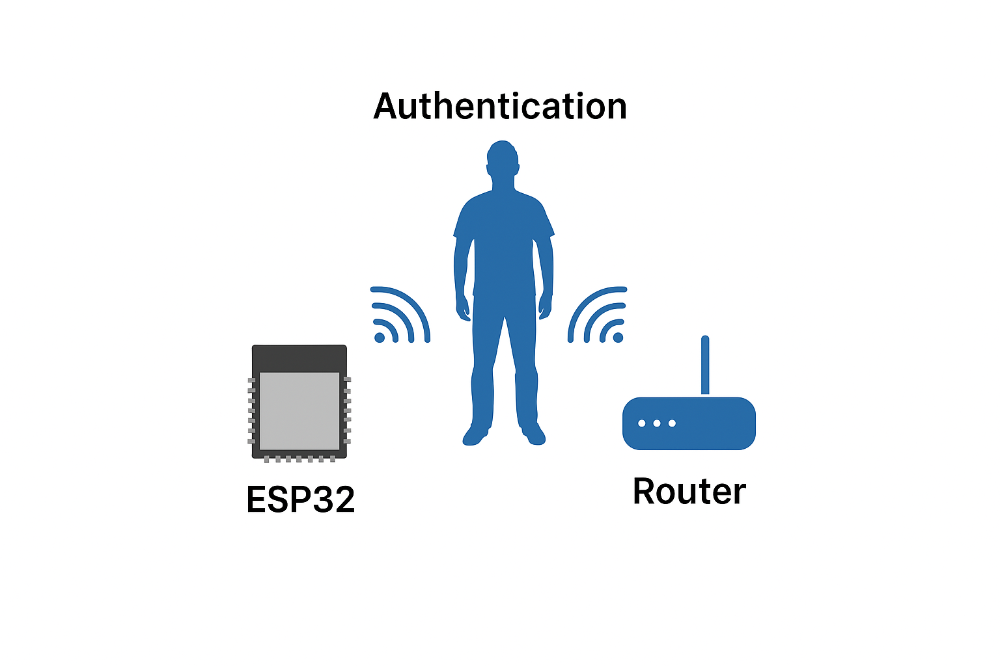

# CSI ESP32 Tool Kit

Este projeto é um conjunto de ferramentas para autenticação de usuários com base nos dados de Channel State Information (CSI) utilizando um dispositivo **ESP32**.

## Descrição

O projeto permite a captura, processamento, extração de características, visualização e autenticação utilizando sinais CSI. Foi desenvolvido com base no repositório [sbrc2024-csi](https://github.com/c2dc/sbrc2024-csi) e adaptado para uso com o ESP32, utilizando a infraestrutura dos projetos oficiais da Espressif:

- [ESP-IDF](https://github.com/espressif/esp-idf)
- [ESP-CSI](https://github.com/espressif/esp-csi)

---

### 🧠 **Como Funciona**

Abaixo está um diagrama representando a ideia central do projeto, onde o ESP32 se comunica com o roteador Wi-Fi e os sinais CSI são capturados enquanto um usuário está presente entre eles.

<p align="center">
  
</p>

---

## Requisitos

- Python 3.10+
- Dependências listadas em `requirements.txt`
- Ambiente ESP-IDF configurado
- Firmware CSI rodando no ESP32 (via ESP-CSI)
- Projeto clone em `esp-csi/examples/get-started/csi_recv_router`

---

## Estrutura do Projeto

- `csi_capture.py`: Captura os dados CSI do ESP32 via porta serial.
- `csi_processing.py`: Aplica filtros (Hampel, passa-baixa) e extrai estatísticas dos sinais CSI.
- `csi_train_models.py`: Treina classificadores (Random Forest, SVM, KNN, Isolation Forest) para autenticação.
- `csi_auth.py`: Autentica uma nova captura usando os modelos treinados.
- `csi_plot.py`: Geração de gráficos de análise (PCA, variância, correlação, biplot).
- `csi_labeling.py`: Adiciona rótulos e organiza as coletas CSI.

---

## Como Usar

### 1. Instale as dependências

```bash
pip install -r requirements.txt
```

### 2. Capture dados CSI

```bash
python csi_capture.py --duration 60 --output data/csi_data.csv
```

### 3. Processe os dados

```bash
python csi_processing.py --input data/csi_data.csv
```

### 4. Classifique os dados

```bash
python csi_labeling.py --label giovani --environment env1 --position standing
```

### 5. Treine os modelos (após criar um dataset)

```bash
python csi_train_models.py
```

### 6. Valide uma captura em tempo real

```bash
python csi_auth.py --input data/csi_features.csv
```

---

## Observações

- Utilize o `csi_labeling.py` para rotular corretamente os dados capturados antes de treinar os modelos.
- Os filtros aplicados aumentam a qualidade dos dados e reduzem ruído, sendo integrados diretamente ao `csi_processing.py`.

---

## Baseado em

- [sbrc2024-csi](https://github.com/c2dc/sbrc2024-csi)

---

## Licença

MIT
