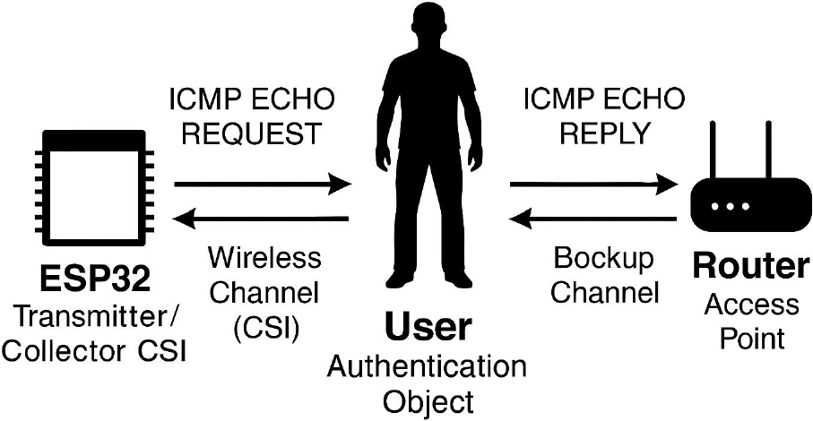

# CSI ESP32 Tool Kit

This project is a set of tools for user authentication based on Channel State Information (CSI) data using an **ESP32** device.

## Description

The project enables the capture, processing, labeling, model training, and authentication of users based on CSI signals. It was developed from the repository [sbrc2024-csi](https://github.com/c2dc/sbrc2024-csi), adapted for use with ESP32 authentication.

---

### 🧠 **How It Works**

The ESP32 collects CSI data while network traffic (e.g., ping) occurs and a user is either present or not in the environment. These data are processed, labeled, and used to train machine learning authentication models.

<p align="center">
  
</p>

---

## Requirements

- Python 3.10+
- Dependencies listed in `requirements.txt`
- ESP-IDF environment configured
- CSI firmware running on ESP32 (via ESP-CSI)

---

## File Structure

- `capture_csi.py`: Captures CSI data from ESP32 via UART serial port and saves it as CSV.
- `process_csi.py`: Processes raw CSV, applying normalization and low-pass filters to amplitude and phase signals.
- `auth_csi.py`: Authenticates a new processed capture and trains machine learning using Random Forest model.

---

## How to Use

### 1. Install dependencies

```bash
pip install -r requirements.txt
```

### 2. Capture CSI data

```bash
python capture_csi.py -p /dev/ttyUSB0 -t 60 -o data/data_csi.csv
```

### 3. Process the captured data

```bash
python process_csi.py -i data/data_csi.csv -o data/processed_csi.csv
```

### 4. Authenticate a new capture and train Random Forest model

```bash
python auth_csi.py -i data/processed_csi.csv -u giovani
```

---

## Based on

- [sbrc2024-csi](https://github.com/c2dc/sbrc2024-csi)

---

## License

MIT
