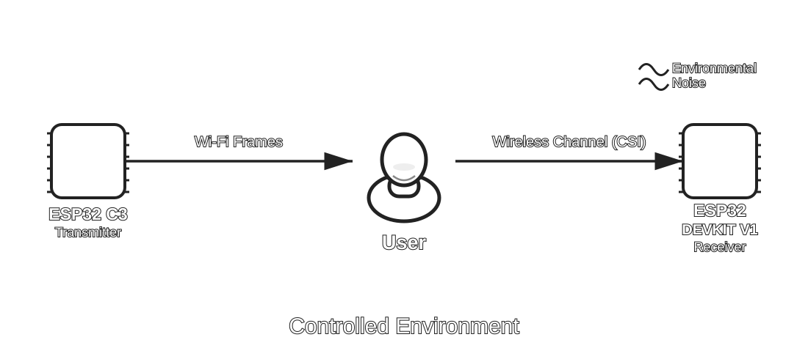

# CSI ESP32 Tool Kit

This project provides tools for capturing and classifying Channel State Information (CSI) data using an ESP32 device for user authentication.

## Overview

The system captures CSI data from an ESP32 via UART and processes it for multi-class user authentication using machine learning models. It is adapted from the [sbrc2024-csi](https://github.com/c2dc/sbrc2024-csi) repository for use with ESP32.

## Experimental Setup

The experiments were conducted to evaluate the feasibility of using Channel State Information (CSI) for user authentication in Wi-Fi environments, considering the impact of environmental noise. For this purpose, an experimental setup was used based on two ESP32 devices: an ESP32 DEVKIT V1 model for capturing CSI data and an ESP32 C3 Super Mini model for sending Wi-Fi frames. The samples collected from this structure are made possible through Espressif's ESP-CSI framework.

Each CSI sample contains three hundred and eighty-four (384) floating-point values, corresponding to 192 complex I/Q samples (I = in-phase component, Q = quadrature component), which are converted into complex numbers (I + jQ). These 192 complex samples are organized into 64 subcarriers for each of the 3 simulated spatial streams by the ESP32 DevKit V1 firmware, even though the hardware has only one physical antenna. Thus, the data structure consists of 64 subcarriers multiplied by 3 antennas, totaling 192 complex samples, whose I and Q values are interleaved among the 384 floating points of each CSI sample. The data was collected in a controlled environment with three distinct users: Aline, Giovani, and Ines. As a criterion, the user had to be close to the receiving ESP32, in a static position with their hand over the device. The collection was performed using the `capture_csi.py` script, which captures raw CSI data via the ESP32's UART serial port and stores it in a CSV file. Each capture includes metadata such as user, position, and environment, ensuring data traceability.

After collection, the data was processed with the `classifier_csi.py` script, which converts raw CSI values into amplitudes, filters selected users, encodes labels, splits the data into training and test sets (with a stratified split of 50%), normalizes features, and trains multiple classifiers. The evaluated models include Random Forest, SVC, KNN, Logistic Regression, and Gradient Boosting. **It is important to note that, to date, no filters have been applied to remove null or pilot subcarriers.**

<p align="center">
  
</p>

## Requirements

- Python 3.8 or higher
- Packages listed in `requirements.txt`
- ESP-IDF environment configured
- ESP32 running the CSI firmware (via ESP-CSI)

## File Structure

| File                   | Description                                                                 |
|------------------------|-----------------------------------------------------------------------------|
| `capture_csi.py`       | Captures CSI data via UART from ESP32 and saves it to a CSV file            |
| `classifier_csi.py`    | Processes CSI data and performs user classification using machine learning models |

## How to Use

### 1. Install Dependencies

Create a virtual environment (recommended) and install the required packages:

```bash
python -m venv venv
source venv/bin/activate  # Linux/Mac
venv\Scripts\activate     # Windows
pip install -r requirements.txt
```

### 2. Capture CSI Data

Run the following command to capture CSI data from the ESP32 and save it to a CSV file:

```bash
python capture_csi.py --port /dev/ttyUSB0 -t 60 -u giovani -o data/data_csi.csv
```

- `--port`: Serial port where the ESP32 is connected (e.g., `/dev/ttyUSB0` or `COM3` on Windows).
- `-t`: Capture duration in seconds (e.g., `60` for 60 seconds).
- `-u`: User associated with the capture (required, e.g., `giovani`).
- `-o`: Output CSV file (default: `data/data_csi.csv`).

### 3. Classify Users

Run the classifier to process the CSI data and perform user authentication:

```bash
python classifier_csi.py
```

This script processes the CSV file (`data/data_csi.csv` by default), trains machine learning models (RandomForest, GradientBoosting, SVC, KNN, LogisticRegression), and generates visualizations such as PCA, t-SNE, confusion matrices, and ROC curves.

## Based On

- [sbrc2024-csi](https://github.com/c2dc/sbrc2024-csi)

## License

MIT