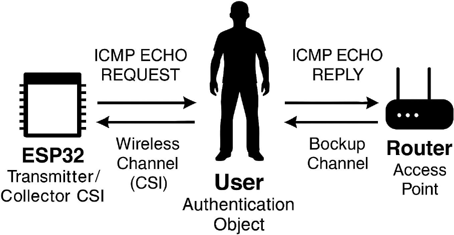

# CSI ESP32 Tool Kit

This project provides a complete toolset for user authentication based on Channel State Information (CSI) using an **ESP32** device.

## 🧠 Overview

The system enables CSI data capture, processing, training, and user authentication using machine learning models. It was adapted from the original [sbrc2024-csi](https://github.com/c2dc/sbrc2024-csi) repository for real-time use with the ESP32 and UART-based communication.

<p align="center">
  
</p>

---

## ⚙️ Requirements

- Python 3.10+
- Packages listed in `requirements.txt`
- ESP-IDF environment configured
- ESP32 running the CSI firmware (via ESP-CSI)

---

## 📁 File Structure

| File                   | Description                                                                 |
|------------------------|-----------------------------------------------------------------------------|
| `capture_csi.py`       | Captures CSI data via UART from ESP32 and saves it to CSV                  |
| `process_csi.py`       | Processes raw CSI data: normalizes, filters and extracts statistical features |
| `auth_csi.py`          | Authenticates the user and manages dataset updates and model training       |
| `pipeline_csi.py`      | Orchestrates the entire CSI pipeline: capture → process → authenticate      |
| `model_manager.py`     | Trains and saves machine learning models (binary and one-vs-all classifiers)|
| `validation_manager.py`| Generates PCA, KNN, and distance-based visualizations for authentication     |

---

## 🚀 How to Use

### 1. Install dependencies

```bash
pip install -r requirements.txt
```

### 2. Capture CSI data from the ESP32

```bash
python capture_csi.py --port /dev/ttyUSB0 -t 60 -u giovani -o data/data_csi.csv
```

### 3. Process the captured data

```bash
python process_csi.py -i data/data_csi.csv -o data/processed_csi.csv
```

### 4. Authenticate the capture using trained models

```bash
python auth_csi.py -i data/processed_csi.csv -u giovani
```

### 5. (Optional) Run the entire pipeline in one step

```bash
python pipeline_csi.py -t 60 -u giovani
```

---

## 🧠 Train All Models

To retrain all classification models using the current dataset:

```bash
python model_manager.py -d dataset/dataset.csv -m model
```

---

## 📊 Generate Validation Visualizations

Run PCA, distance histograms, and simulated confusion matrix using KNN:

```bash
python validation_manager.py -d dataset/dataset.csv -i data/processed_csi.csv -u giovani
```

This step is useful for assessing the separability of the new capture.

---

## 📌 Based On

- [sbrc2024-csi](https://github.com/c2dc/sbrc2024-csi)

---

## 📝 License

MIT
